# ASCON

`K`: Khóa bí mật secret key K của k ≤ 160 bits

`N, T`: Nonce N, thẻ Tag T, all 128 bit

`P, C, A`: Văn bản thuần Plaintext P,  bản mã ciphertext C, dữ liệu liên quan associated data A (trong các khối r-bit Pi, Ci, Ai)

`M, H`: Message M, hash value H (in r-bit blocks Mi, Hi)

`⊥`: Error, xác minh bản mã xác thực không thành công

## ✨Initialization

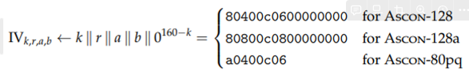

### Vector Khởi Tạo (`IV`)

Vector Khởi Tạo được tạo ra bằng cách nối các tham số sau:

> **`k`**: Kích thước khóa 128bit
> 

> **`r`**: Tốc độ (rate), là độ dài của khối sẽ được xử lý trong quá trình mã hóa.
> 

> **`a`**: Số vòng lặp trong giai đoạn khởi tạo và hoàn tất.
> 

> **`b`**: Số vòng lặp trong giai đoạn xử lý dữ liệu.
> 

Thêm vào chuỗi bit số 0 có độ dài 160−k bit, đảm bảo rằng `IV` có kích thước nhất quán bất kể độ dài của khóa.

Giá trị `IV` cho các biến thể Ascon là khác nhau chúng là các hằng số, nhất quán và bảo mật trong quá trình khởi tạo:

- **80400c0600000000** cho `Ascon-128.`
- **80800c0800000000** cho `Ascon-128a`.
- **a0400c06** cho `Ascon-80pq`.

### Trạng Thái Ban Đầu (S)

Trạng thái ban đầu (S) được hình thành bằng cách nối IV với khóa bí mật K và nonce N:

Điều này có nghĩa là trạng thái SSS bao gồm:

1. `IV` đặc trưng cho biến thể Ascon.
2. Khóa bí mật `K` (là 128 bit cho Ascon-128/128a hoặc 80 bit cho Ascon-80pq).
3. Nonce `N`, là giá trị duy nhất cho mỗi lần mã hóa để đảm bảo rằng ngay cả với cùng một plaintext và khóa, ciphertext sẽ khác nhau.

Trạng thái ban đầu `S` này là điểm khởi đầu cho quá trình hoán vị diễn ra trong giai đoạn khởi tạo của mã hóa Ascon.

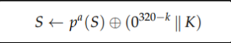

> `pa(S)` là kết quả của**a** vòng biến đổi áp dụng lên trạng thái ban đầu `S`
> 

> 0^320−k là chuỗi bit 0 với độ dài bằng 320−k (tùy thuộc vào độ dài của khóa bí mật `K`)
> 

> `∥ K` là việc nối chuỗi số 0 này với khóa bí mật K
> 

> Phép `XOR` này sẽ cập nhật lại trạng thái `S`.
> 

## ✨Processing Associated Data

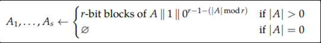

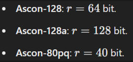

- **Bước 1: Thêm Padding**

Nếu dữ liệu liên quan  A có độ dài không phải là bội số của r, huật toán sẽ thêm một bit số 1 vào cuối A và tiếp theo là thêm một số lượng nhỏ nhất các bit 0 để tạo ra độ dài bội của  r. Điều này giúp cho A có thể được chia thành các khối có kích thước bằng nhau.

- **Bước 2: Chia Thành Các Khối**

Sau khi thêm padding, dữ liệu A sẽ được chia thành s khối, mỗi khối có độ dài r bit: A1 || ….||As.

### Với điều kiện:

> Nếu A > 0: Dữ liệu A sẽ được chia thành các khối có độ dài r, thêm bit số 1 và các bit 0 để tạo ra một bội số của r.
> 

> Nếu A = 0: không có khối nào được tạo.
> 

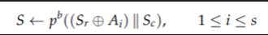

> Sr: Phần đầu tiên của trạng thái S, gồm r bit (r = 64 bit)
> 

> Sc: Phần còn lại của trạng thái S, gồm 320 -r bit (ví dụ: 256 bit đối với Ascon-128).
> 

## ✨Processing Plaintext

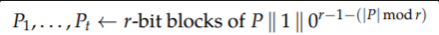

Quá trình đệm thêm một số 1 và số 0

> ví dụ:
> 

**Độ dài P=100 bit. (r = 64 bit)**

- **Khối đầu tiên**: 64 bit đầu tiên của P.
- **Khối thứ hai**: 36 bit văn bản gốc + 1 bit '1' (đệm) + 27 bit '0' (đệm) để đạt tổng 64 bit cho khối thứ hai.

### Encryption

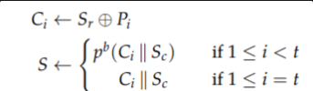

Trích xuất khối bản mã `Ci` (ciphertext block `Ci`) được gán bởi `Sr` ( phần đầu tiên của trạng thái `S`) `XOR` với `Pi`

Tiếp theo, nối `Ci` với `Sc` (phần còn lại của trạng thái `S`) rồi hoán vị b lần và gán cho `S`. Với `i=t` thì không cần hoán vị.

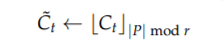

Khối bản mã cuối cùng `Ct` được cắt ngắn theo `|P| mod r` bit đầu sao cho độ dài  nằm trong khoảng 0 đến r-1 bit. Và chiều dài của bản mã `C` giống với bản rõ `P`.

### Decryption

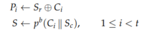

Trừ lần lặp cuối cùng, khối bản rõ Pi được tính bằng cách `XOR` khối bản mã `Ci` với `Sr`.

Tiếp theo, nối `Ci` với `Sc`  (phần còn lại của trạng thái `S`) rồi hoán vị `b` lần và gán cho `S` (trừ khối cuối cùng).

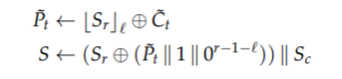

Khối văn bản mã hóa cuối cùng đã được cắt ngắn `Sr` và `XOR` với `Ct cuối`để lấy phần cuối của văn bản gốc:

Trạng thái `S` được cập nhật với phần đoạn văn bản gốc cuối cùng này

## ✨Finalization

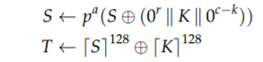

> c là độ dài của trạng thái (256 bit), k là độ dài khóa ( 128), và r là độ dài khối(64 bit).
> 

Thẻ T bao gồm 128 bit, được XOR bởi 128 bit cuối của cả S và K

Đây là một bước quan trọng để xác định tính toàn vẹn của dữ liệu: tag (`T`) này sẽ được gửi kèm với văn bản mã hóa. Trong quá trình giải mã, tag nhận được sẽ được so sánh với tag tính toán lại để đảm bảo rằng dữ liệu không bị giả mạo hoặc thay đổi

## 🧨Permutation (hoán vị)

`Pa` và `Pb` chỉ khác nhau về số vòng. Số vòng a và số vòng b là các thông số bảo mật có thể điều chỉnh.

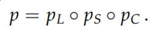

320 bit S được chia thành 5 thanh ghi 64 bit

- Addition of Constants (Pc)
    
    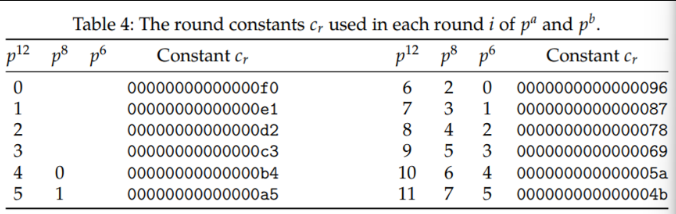
    
    Hằng số tròn cr được sử dụng trong mỗi vòng i của pa và pb
    
    
    
- Substitution Layer (Ps)
    
    Sau đó lấy từng bit một của mỗi xi trong đó `x0` là `MSB` còn x4 là `LSB` và so sánh với bảng dưới đây làm lần lượt hết 64 bit.
    
    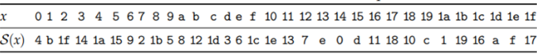
    
    S-box S 5-bit của Ascon làm bảng tra cứu
    
    khi làm xong 64 lần thì sẽ có x0 → x4 mới
    
    ví dụ:
    
    | x0 | 0011 |
    | --- | --- |
    | x1 | 0101 |
    | x2 | 0010 |
    | x3 | 0110 |
    | x4 | 1100 |
    
    | x0 | 0… |
    | --- | --- |
    | x1 | 1… |
    | x2 | 0… |
    | x3 | 1… |
    | x4 | 1… |
    
    Lấy bit đầu tiên của `x0` → `x1`: 00001. Ta sẽ được số tương ứng là 1. Tra trong bảng thì ta được `S(x)` mới là b, quy đổi ra hệ thập lục phân là 01011. Tiếp tục làm 64 lần.
    
- Linear Diffusion Layer (Ps)
    
    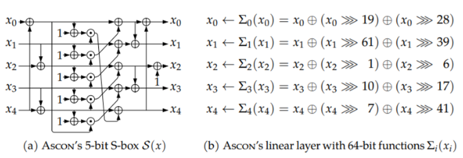
    
    Σ0(x0)
    
    1. Xoay phải (dịch chuyển tròn) 19 bit.
    2. Xoay phải (dịch chuyển tròn) 28 bit.
    3. Thực hiện `XOR` giữa kết quả của các phép dịch và giá trị ban đầu `x0` để tạo ra một `x0` mới
    
    Làm tương tự cho các xi còn lại